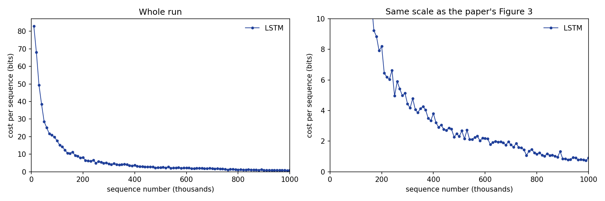

# neural-turing-machines

A PyTorch reproduction of the LSTM baseline on the **copy task** from
[Neural Turing Machines](https://arxiv.org/abs/1410.5401) (Graves, Wayne & Danihelka, 2014).

## The copy task

The network reads a sequence of random 8-bit vectors, then a delimiter flag, and must then
output the same sequence from memory while receiving no further input.

- Sequence length `L` is random between 1 and 20
- Each timestep's input has 9 channels: 8 data bits + 1 delimiter channel
- The input is `L` data steps, 1 delimiter step, then `L` blank steps, for `2L + 1` in total
- Only the last `L` outputs are scored against the target

## Models

| | Paper | This repo |
|---|---|---|
| `lstm` | 3 layers x 256, 1,352,969 parameters | 1,328,136 |
| `ntm-ff` | NTM, feed-forward controller, 17,162 | 16,096 |
| `ntm-lstm` | NTM, LSTM controller, 67,561 | 62,660 |

All three share the copy task, the training loop and the plots, and take
`(batch, 2L+1, 9)` to `(batch, 2L+1, 8)`.

### Speed and stability notes for the NTM

The NTM runs a Python loop over timesteps with many small operations per step, so a GPU spends
its time launching kernels rather than computing: on the copy task it is several times slower
than a CPU. Training therefore defaults to the CPU for `ntm-ff` and `ntm-lstm`, and to the GPU
for the LSTM baseline, whose whole sequence runs in one cuDNN kernel. Override with `--device`.
`--compile` gives about 1.7x per step, after a warmup that recompiles for each sequence length.

The NTM also clips gradients by norm rather than by value. The paper clips each component to
(-10, 10), which bounds each number but not the size of the update: NTM gradient norms spike to
several hundred times their median, and with value clipping those spikes produce an enormous step
that destroys what the model has learned. The LSTM baseline keeps the paper's value clipping.

Common settings from the paper (Section 4.6 and Tables 1-3): RMSProp with momentum 0.9,
gradients clipped elementwise to (-10, 10), cross-entropy reported in bits per sequence, and a
learning rate of 3e-5 for the LSTM baseline or 1e-4 for the NTMs. The NTMs use a 128 x 20
memory, a controller of 100 units, and one read and one write head.

## Usage

Requires [uv](https://docs.astral.sh/uv/).

```sh
uv sync

# Run one batch through an untrained model and print the shapes
uv run main.py demo --model ntm-ff

# Train on the copy task (1M sequences as in the paper; results go to results/copy/<model>/)
uv run main.py train --model lstm       # the 3 x 256 LSTM baseline
uv run main.py train --model ntm-ff     # NTM, feed-forward controller
uv run main.py train --model ntm-lstm   # NTM, LSTM controller
uv run main.py train --model ntm-ff --sequences 50000 --batch-size 16   # quicker run
uv run main.py train --model ntm-ff --device cpu --compile                # NTM speed options

# Draw the learning curve (Figure 3) and generalisation plot (Figure 5) into figures/
uv run main.py plot --model ntm-ff

# Give a trained model your own 8-bit vectors, or a random sequence, and see what it copies back
uv run main.py try --model ntm-ff 10110010 01100101 11110000
uv run main.py try --model ntm-ff --random 30

# Checks for the NTM's memory, addressing and gradients
uv run pytest
```

### On Google Colab (GPU)

[Open colab.ipynb in Colab](https://colab.research.google.com/github/mgupta8143/neural-turing-machines/blob/main/colab.ipynb),
switch the runtime to a T4 GPU, and run the cells. Training runs in the background and you can
plot at any point.

## Results

One run of 1M sequences on a Colab T4 GPU, using the quick settings: **batch size 16, learning
rate 1e-4**. Everything else matches the paper.

### Learning curve (paper Figure 3)



Each dot is the average cost over 10k sequences. The left panel shows the whole run; the right
uses the paper's 0–10 bit scale.

| Sequences seen | This run | Paper's LSTM (read off Figure 3) |
|---|---|---|
| 10k | 83.0 bits | above 10 |
| 100k | 17.7 bits | ~5 bits |
| 200k | 8.2 bits | ~2 bits |
| 500k | 2.3 bits | ~0.5 bits |
| 1M | 0.9 bits | ~0.5 bits |

### Generalisation (paper Figure 5)


Top row: lengths 10, 20, 30 and 50. Bottom row: length 120. The model was only trained on lengths 1–20.
Blue is 0, red is 1, and green (about 0.5) means the model is guessing.

### Compared with the paper

**Similarities**

- **Same learning curve shape:** a fast drop from random guessing (about 84 bits), then a long,
  slow tail towards zero.
- **Learns the training range:** length 10 is copied perfectly, and length 20 almost perfectly,
  with only a vector or two blurred.
- **Fails to generalise, the paper's main LSTM result:** at lengths 30, 50 and 120 it copies
  roughly the first dozen vectors, then falls back to about 0.5 guesses for the rest. It hasn't
  learned a copying *procedure*. It has learned to hold about as much as it saw in training, which
  is what the NTM's external memory is meant to fix.

**Differences**

- **It learns about 2–3× slower.** It drops below 10 bits at about 170k sequences (paper: about
  60–70k) and ends at 0.9 bits rather than about 0.5. The main reason is batch size: with 16
  sequences per update, 1M sequences is only about 62k weight updates. At batch size 1, which the
  paper most likely used (it doesn't say), that would be 1M updates. A higher learning rate only
  partly makes up for this.
- **It was still improving at 1M sequences,** so a longer run would probably close some of the gap.
- **We don't clearly see the accurate prefix shrink as the length grows.** The paper notes this in its
  Figure 5 caption. Here the prefix stays at roughly a dozen vectors, and some of the *last* few
  vectors also come out right, probably because they're the most recently stored.
- **Smaller implementation details:** PyTorch's standard RMSProp rather than Graves' (2013)
  variant, zeros rather than a learned starting state, and about 2% fewer parameters (1,328,136 vs
  1,352,969). These likely matter much less than the batch size.
- **Single run:** the paper's curve is also a single run, and seeds vary.

To compare exactly with the paper, run with its settings (`uv run main.py train`: batch size 1,
learning rate 3e-5). That takes about 6.5 hours on a T4.

## Layout

```
main.py                    command line: demo / train / plot
colab.ipynb                run training and plots on a Colab GPU
src/models/lstm.py         LSTM baseline: nn.LSTM (3 × 256) + linear readout to 8 bits
src/models/build.py        model names -> models, and the paper's learning rate for each
src/models/ntm/memory.py   read, write and the four addressing stages (paper Figure 2)
src/models/ntm/heads.py    ReadHead and WriteHead: one Linear -> addressing -> read or write
src/models/ntm/controllers.py  FeedForwardController and LSTMController, same interface
src/models/ntm/ntm.py      controller + heads + memory + output layer, one timestep at a time
tests/test_ntm.py          checks for the memory, addressing and gradients
src/tasks/copy/data.py     copy_batch() -> x (B, 2L+1, 9), target (B, L, 8)
src/tasks/copy/train.py    training loop; the paper's settings live in TrainConfig
src/tasks/copy/plots.py    Figure 3 (learning curve) and Figure 5 (generalisation)
src/tasks/copy/try_it.py   run the trained model on a sequence you type in
figures/                   saved plots shown in this README
results/                   training logs and model checkpoints (not committed)
```

## Roadmap

- [x] Copy task data
- [x] LSTM baseline model
- [x] Training loop matching the paper's settings
- [x] Log training cost and save checkpoints
- [x] Learning curve plot (paper Figure 3)
- [x] Generalisation plot for lengths 10, 20, 30, 50, 120 (paper Figure 5)
- [x] Full 1M-sequence run (batch size 16) and results
- [ ] Paper-faithful run at batch size 1
- [x] NTM: memory, addressing, heads, both controllers
- [ ] NTM copy-task runs and figures
- [ ] Memory-use plot (paper Figure 6)
