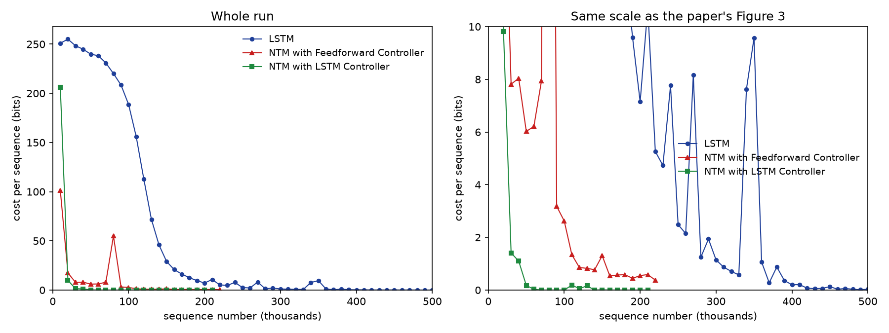
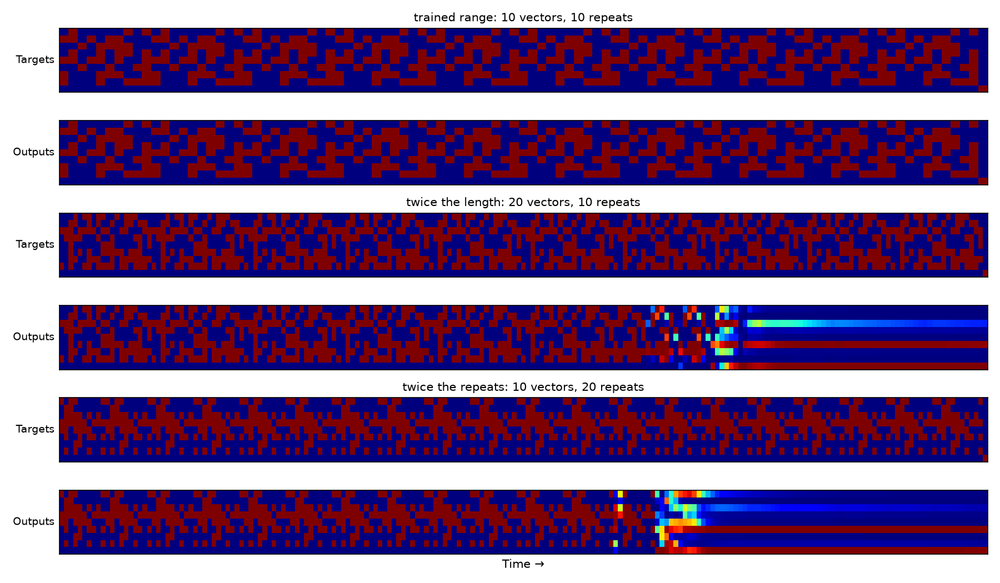
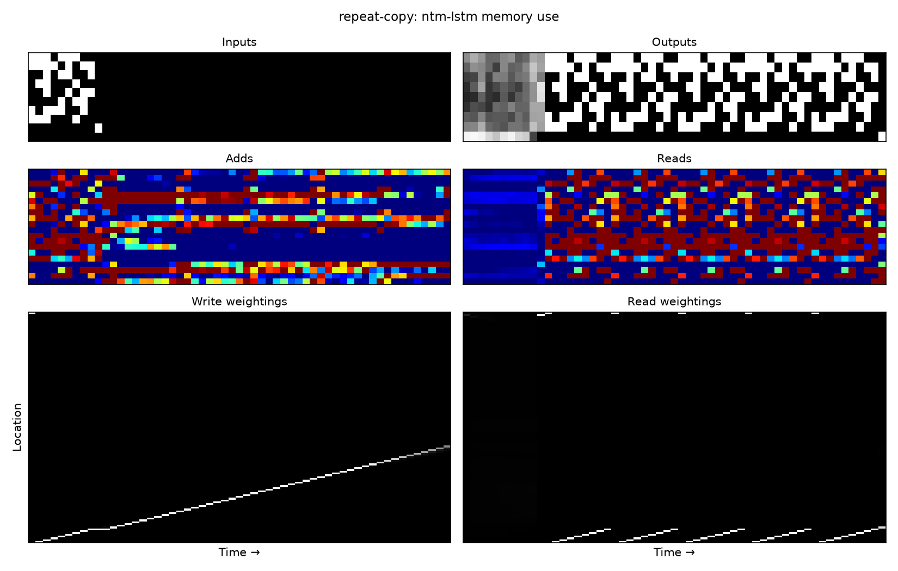

# Results: the copy task

Three models, 500,000 sequences each, at the paper's settings: one sequence per update, RMSProp
with momentum 0.9 in the form Graves (2013) describes, gradients clipped, and the learning rates
from Tables 1 to 3. Trained on A10G GPUs; every run is reproducible with `--seed`, and each one
records its settings in `results/copy/<model>/run.json`.

## Learning curves (paper Figure 3)


| Sequences seen | LSTM | NTM, feed-forward | NTM, LSTM controller |
|---|---|---|---|
| 10k | 77.5 bits | **0.00** | **0.00** |
| 100k | 10.1 | 0.00 | 0.00 |
| 200k | 4.0 | 0.00 | 0.00 |
| 500k | **1.03** | **0.0000** | **0.0000** |
| first below 0.05 bits | never | 5,000 | 10,000 |

Both NTMs solve the task within the first few thousand sequences and hold at zero for the
remaining 490,000. The LSTM baseline needs the whole run to reach about one bit. That is the
paper's central claim, and the gap is the same order as its Figure 3 shows.

The paper reports the LSTM-controller NTM converging fastest. Ours converges second, at 10k
sequences against the feed-forward controller's 5k — close, but the ordering is reversed.

## Generalisation (paper Figures 4 and 5)

Trained only on lengths 1 to 20, tested well beyond. Percentage of output bits wrong:

| Test length | 10 | 20 | 30 | 50 | 80 | 120 |
|---|---|---|---|---|---|---|
| LSTM | 0.0% | 3.1% | 22.9% | 40.0% | 46.4% | 48.0% |
| NTM, feed-forward | 0.0% | 0.0% | **0.0%** | **0.0%** | **0.0%** | **0.0%** |
| NTM, LSTM controller | 0.0% | 0.0% | **0.0%** | **0.0%** | **0.0%** | **0.0%** |

Both NTMs copy perfectly at six times their training length. The LSTM degrades exactly as the
paper describes: fine to 20, then the accurate prefix shrinks as the sequence grows, until at 120
it is wrong on half the bits, which is chance.


*NTM, feed-forward controller. Lengths 10, 20, 30, 50 across the top; 120 below. Blue is 0, red
is 1; green would mean the model is unsure.*


*The LSTM baseline on the same lengths. The green and yellow bands are the model hedging at 0.5
because it has run out of capacity to hold the sequence.*

## Memory use (paper Figure 6)


*Left: the input, the vectors written to memory, and the write weightings. Right: the output, the
vectors read back, and the read weightings. Sequence length 40, double the training range.*

The white diagonal is the whole story. The write head advances exactly one memory location per
timestep while reading the input, and the read head then retraces the same diagonal during
recall. Measured on the trained model, the step is +1.00 locations per timestep with the
weighting pinned at 0.999, inside and beyond the training range alike. That is the paper's
pseudocode - write, increment, return to start, read, increment - learned from gradients alone.

## What matched, and what did not

**Matched.** The shape and separation of the learning curves. Near-zero cost for both NTMs and
about one bit for the LSTM. Perfect NTM generalisation far past the training range, and the
LSTM's failure mode, including the shrinking accurate prefix. The learned copy algorithm visible
in the memory traces.

**Did not match.** The paper's LSTM-controller NTM converges fastest; ours is second (10k versus
5k sequences). Parameter counts are 1 to 3% below the paper's for every model, which suggests a
small structural difference we could not pin down - an attempt to match all ten published counts
exactly failed, and found that Tables 1 and 2 disagree with each other on parity, so the
published numbers are not fully self-consistent.

## Things the paper leaves out that decide whether this works

Four details cost real time. Each is a deviation or an addition, and each is load-bearing.

**The optimiser.** Section 4.6 cites RMSProp "in the form described in (Graves, 2013)": centered,
decay 0.95, and a damping term of 1e-4 inside the square root. PyTorch's defaults are 0.99 and
1e-8, and that 1e-8 inflates the update wherever gradient variance is small - which is most of an
LSTM controller's recurrent matrix. With the defaults, our LSTM-controller NTM reached zero cost
and then *drifted off it*: by the end of a million sequences it was 46% wrong at length 50 and
oscillating between 0.009 and 1.06 bits. With the paper's form it sits at exactly 0.0000 for
450,000 consecutive sequences and copies length 120 perfectly. The same change roughly halved the
LSTM baseline's cost at every checkpoint.

**Clipping by norm rather than by value.** The paper clips each gradient component to (-10, 10).
NTM gradient norms spike to hundreds of times their median, and value clipping turns such a spike
into an enormous update that destroys the learned addressing. Clipping the norm instead was the
difference between diverging mid-run and reaching zero.

**The starting memory has to break symmetry.** With identical memory rows and uniform weightings,
every location is interchangeable, their gradients are identical, and the 128 locations never
differentiate: the model plateaus near chance. Random starting values fix it - on a fixed-length-5
copy, 1,200 updates reach 1.1 bits with random initialisation against 34 bits with constant.

**Sharpening underflows if written literally.** Equation 9 raises the weighting to a power. Small
weights at a high power underflow float32 to zero, the renormalisation then divides by zero, and
the head attends to nothing. `softmax(gamma * log w)` is the same expression and is stable.

## Reproducing

```sh
uv sync --frozen
uv run main.py train --model ntm-ff --sequences 500000
uv run main.py compare
uv run main.py plot --model ntm-ff
uv run main.py memory --model ntm-ff --length 40
```

About 70 minutes per NTM on an A10G, or four hours on a laptop CPU; `modal_run.py` runs it on a
rented GPU and downloads the results.

---

# Results: the repeat copy task

The same three models and the same 500,000 sequences, on the task from Section 4.2: read up to
ten 8-bit vectors and a scalar repeat count, then emit the sequence that many times and raise an
end-of-sequence marker. Both L and R are drawn from 1 to 10, so the longest training example is
112 timesteps. Architectures and learning rates are the paper's Tables 1 to 3 again: 3e-5 for the
LSTM baseline (5,280,265 parameters), 1e-4 for both NTMs (16,317 and 66,217).

## Learning curves (paper Figure 7)



Cost in bits per sequence, as a rolling median over the last 20,000 sequences - at one sequence
per update the mean is dominated by a heavy tail of rare bad batches, which is what makes the raw
curve so noisy:

| | first median below 1 bit | first below 0.1 bits | median at the end |
|---|---|---|---|
| NTM, LSTM controller | **38,000** | **54,000** | **0.0003** |
| NTM, feed-forward | 121,000 | - | 0.68 |
| LSTM | 307,000 | 419,000 | 0.0088 |

The ordering matches the paper's Figure 7: the LSTM-controller NTM first, the feed-forward NTM
next, the LSTM baseline last, by roughly an order of magnitude in sequences. Two differences from
the paper. Our LSTM baseline does eventually solve the task, at about 400,000 sequences, where
the paper's is still well above zero at the end of its run. And our feed-forward NTM does not
fully settle: it reaches about 0.7 bits and stays there, hitting exact zero on most sequences but
losing a whole copy on a minority of them.

## Generalisation (paper Figure 9)

Trained on L, R up to 10. Percentage of output *data* bits wrong, ten sequences per cell; the
end-of-sequence marker is scored separately below.

| | trained (L10 R10) | twice the length (L20 R10) | twice the repeats (L10 R20) | 1.5x both (L15 R15) |
|---|---|---|---|---|
| LSTM | 0.0% | 45.5% | 4.5% | 46.1% |
| NTM, feed-forward | 0.1% | 40.2% | 48.8% | 44.1% |
| NTM, LSTM controller | 0.0% | **20.6%** | **17.7%** | **24.5%** |



*NTM, LSTM controller. Each pair is targets above, outputs below: the trained range, then twice
the length, then twice the repeats.*

**This is the one place the reproduction clearly falls short.** The paper's Figure 9 shows an NTM
that keeps copying correctly well past the trained range and fails only on the end marker, which
it never learns to place. Ours copies correctly for roughly the first 150 timesteps of any test
sequence and then degrades, on both axes equally.

That symmetry is the clue: 150 timesteps is close to the 128 locations in memory, and the
degradation does not care whether the extra timesteps came from a longer sequence or from more
repeats. Tracing the heads confirms it. The write head does not stop when the input ends - it
keeps stepping forward one location per timestep through the whole output phase. Inside the
trained range that is harmless, because the longest example is 112 timesteps and the head runs
off the end of the used region into empty memory: at L10 R10, 0 of 101 output-phase writes land
on a location holding data. At L10 R20 the head wraps around the 128 locations and comes back to
the start, and 10 of 201 output-phase writes land on stored vectors, with a mean erase strength
of 0.38 and added vectors of magnitude 1.03. The model overwrites its own input while it is still
reading it out.

The read head shows the other half. At the trained size the LSTM-controller NTM jumps cleanly
back to the start of the sequence at the end of each copy - 9 of 9 jumps, with the weighting
peaking at 0.996. At R = 20 it manages only 11 of 19, and the peak weighting falls to 0.722: by
then the locations it is jumping back to have been partly erased, so content addressing no longer
finds them sharply. The feed-forward controller is worse, hitting only 7 of 9 jumps at a peak of
0.436 even inside the trained range, which is consistent with its higher error everywhere.

None of that is a bug in the addressing - it is a real limitation of what 500,000 sequences of
this task taught the model. Nothing in the training distribution ever punishes writing during the
output phase, because no training sequence is long enough for the write head to come back around.

## Memory use



*The learned loop. The write head lays the sequence down one location per timestep, and the read
head then sweeps the same block of locations once per repeat, snapping back to the first location
each time the copy ends.*

## Two additions the paper does not describe

Repeat copy did not train at all from the same initialisation the copy task uses; both NTMs sat
near chance for 100,000 sequences. Two changes fixed it, and **both are ours, not the paper's**:

**The initial weighting is focused, not random.** Instead of drawing the starting weighting from
a normal, we set it to put all its mass on location 0 (logit 5.0 there, 0 elsewhere). The heads
then start at a definite place in memory and the shift mechanism has something to step from.

**The write gate starts closed.** We bias the interpolation gate to -2.0, so on the first updates
each head leans toward reusing its previous weighting rather than jumping to a content match.
That makes "advance one location per timestep" the easy thing to learn first, and content
addressing something the model adds later.

Both are the sort of initialisation detail the paper does not report, and both are load-bearing
here in a way they are not on the plain copy task. They are also a plausible contributor to the
generalisation gap: a prior that makes location-stepping cheap may be part of why the write head
never learns to stop stepping.

## Reproducing

```sh
uv run main.py train --task repeat-copy --model ntm-lstm --sequences 500000
uv run main.py compare --task repeat-copy
uv run main.py plot --task repeat-copy --model ntm-lstm
uv run main.py memory --task repeat-copy --model ntm-lstm
```
