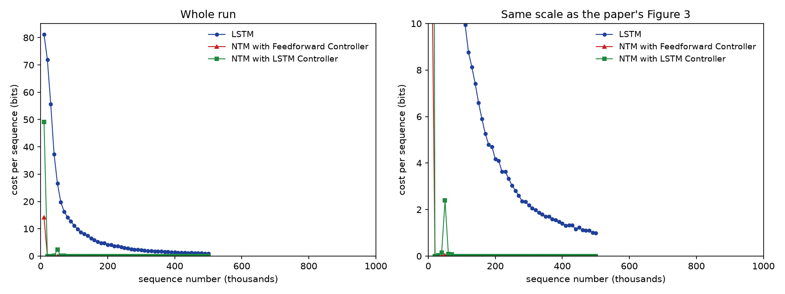
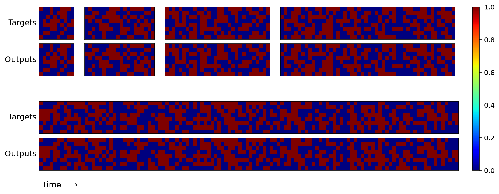
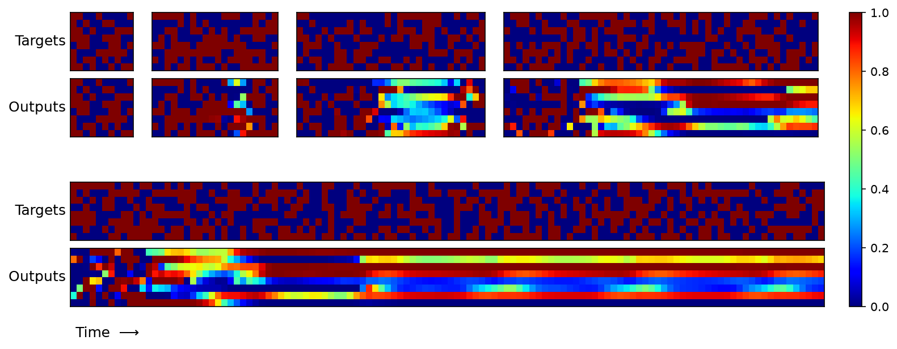
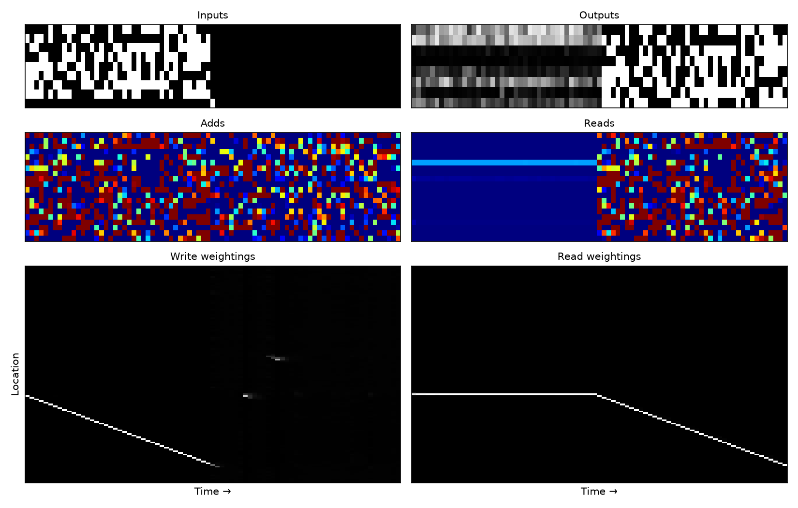

# Results: the copy task

Three models, 500,000 sequences each, at the paper's settings: one sequence per update, RMSProp
with momentum 0.9 in the form Graves (2013) describes, gradients clipped, and the learning rates
from Tables 1 to 3. Trained on A10G GPUs; every run is reproducible with `--seed`, and each one
records its settings in `results/copy/<model>/run.json`.

## Learning curves (paper Figure 3)



| Sequences seen | LSTM | NTM, feed-forward | NTM, LSTM controller |
|---|---|---|---|
| 10k | 77.5 bits | **0.00** | **0.00** |
| 100k | 10.1 | 0.00 | 0.00 |
| 200k | 4.0 | 0.00 | 0.00 |
| 500k | **1.03** | **0.0000** | **0.0000** |
| first below 0.05 bits | never | 5,000 | 10,000 |

Both NTMs solve the task within the first few thousand sequences and hold at zero for the
remaining 490,000. The LSTM baseline needs the whole run to reach about one bit. That is the
paper's central claim, and the gap is the same order as its Figure 3 shows.

The paper reports the LSTM-controller NTM converging fastest. Ours converges second, at 10k
sequences against the feed-forward controller's 5k — close, but the ordering is reversed.

## Generalisation (paper Figures 4 and 5)

Trained only on lengths 1 to 20, tested well beyond. Percentage of output bits wrong:

| Test length | 10 | 20 | 30 | 50 | 80 | 120 |
|---|---|---|---|---|---|---|
| LSTM | 0.0% | 3.1% | 22.9% | 40.0% | 46.4% | 48.0% |
| NTM, feed-forward | 0.0% | 0.0% | **0.0%** | **0.0%** | **0.0%** | **0.0%** |
| NTM, LSTM controller | 0.0% | 0.0% | **0.0%** | **0.0%** | **0.0%** | **0.0%** |

Both NTMs copy perfectly at six times their training length - better, at length 120, than the
paper's own network, whose Figure 4 caption reports *"a few more local errors and one global
error... a single vector is duplicated, pushing all subsequent vectors one step back."* Ours
makes neither mistake. The LSTM degrades exactly as the
paper describes: fine to 20, then the accurate prefix shrinks as the sequence grows, until at 120
it is wrong on half the bits, which is chance.



*NTM, feed-forward controller. Lengths 10, 20, 30, 50 across the top; 120 below. Blue is 0, red
is 1; green would mean the model is unsure.*



*The LSTM baseline on the same lengths. The green and yellow bands are the model hedging at 0.5
because it has run out of capacity to hold the sequence.*

## Memory use (paper Figure 6)



*Left: the input, the vectors written to memory, and the write weightings. Right: the output, the
vectors read back, and the read weightings. Sequence length 40, double the training range.*

The white diagonal is the whole story. The write head advances exactly one memory location per
timestep while reading the input, and the read head then retraces the same diagonal during
recall. Measured on the trained model, the step is +1.00 locations per timestep with the
weighting pinned at 0.999, inside and beyond the training range alike. That is the paper's
pseudocode - write, increment, return to start, read, increment - learned from gradients alone.

## What matched, and what did not

**Matched.** The shape and separation of the learning curves. Near-zero cost for both NTMs and
about one bit for the LSTM. Perfect NTM generalisation far past the training range, and the
LSTM's failure mode, including the shrinking accurate prefix. The learned copy algorithm visible
in the memory traces.

**Did not match.** The paper's LSTM-controller NTM converges fastest; ours is second (10k versus
5k sequences). Parameter counts run 2 to 6% below the paper's - the LSTM controller within 3%,
the feed-forward one consistently 6% under on every task, a structural difference we could not
pin down. An attempt to match all ten published counts exactly failed, and found that the
published numbers are not self-consistent: Tables 1 and 2 disagree on parity, and Table 3 gives
priority sort and N-grams the same 3x128 network but parameter counts 52,519 apart, which their
channel counts cannot account for.

## Things the paper leaves out that decide whether this works

Four details cost real time. Each is a deviation or an addition, and each is load-bearing.

**The optimiser.** Section 4.6 cites RMSProp "in the form described in (Graves, 2013)": centered,
decay 0.95, and a damping term of 1e-4 inside the square root. PyTorch's defaults are 0.99 and
1e-8, and that 1e-8 inflates the update wherever gradient variance is small - which is most of an
LSTM controller's recurrent matrix. With the defaults, our LSTM-controller NTM reached zero cost
and then *drifted off it*: by the end of a million sequences it was 46% wrong at length 50 and
oscillating between 0.009 and 1.06 bits. With the paper's form it sits at exactly 0.0000 for
450,000 consecutive sequences and copies length 120 perfectly. The same change roughly halved the
LSTM baseline's cost at every checkpoint.

**Clipping by norm rather than by value.** The paper clips each gradient component to (-10, 10).
NTM gradient norms spike to hundreds of times their median, and value clipping turns such a spike
into an enormous update that destroys the learned addressing. Clipping the norm instead was the
difference between diverging mid-run and reaching zero.

**The starting memory has to break symmetry.** With identical memory rows and uniform weightings,
every location is interchangeable, their gradients are identical, and the 128 locations never
differentiate: the model plateaus near chance. Random starting values fix it - on a fixed-length-5
copy, 1,200 updates reach 1.1 bits with random initialisation against 34 bits with constant.

**Sharpening underflows if written literally.** Equation 9 raises the weighting to a power. Small
weights at a high power underflow float32 to zero, the renormalisation then divides by zero, and
the head attends to nothing. `softmax(gamma * log w)` is the same expression and is stable.

## Reproducing

```sh
uv sync --frozen
uv run main.py train --model ntm-ff --sequences 500000
uv run main.py compare
uv run main.py plot --model ntm-ff
uv run main.py memory --model ntm-ff --length 40
```

About 70 minutes per NTM on an A10G, or four hours on a laptop CPU; `modal_run.py` runs it on a
rented GPU and downloads the results.
