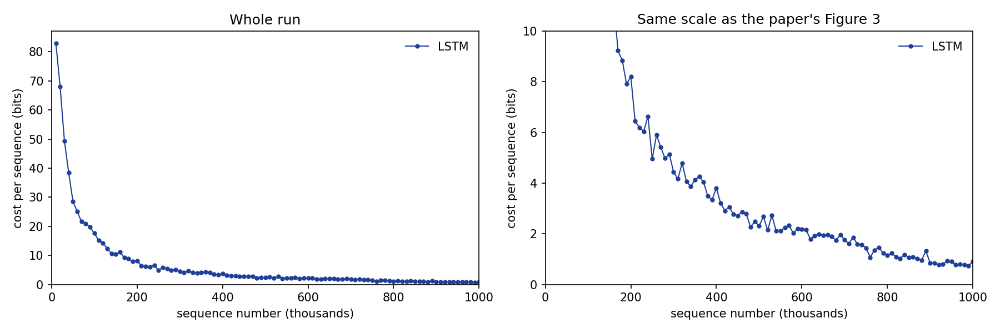
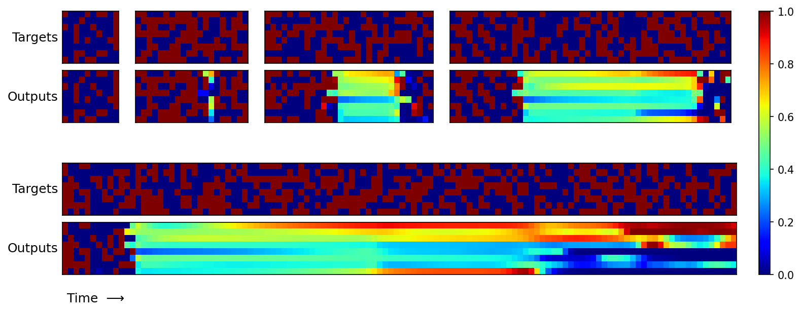

# Results

Everything here is the LSTM baseline. NTM runs are in progress; their sections will go below.

## LSTM baseline

One run of 1M sequences on a Colab T4 GPU, using the quick settings: **batch size 16, learning
rate 1e-4**. Everything else matches the paper.

### Learning curve (paper Figure 3)

Each dot is the average cost over 10k sequences. The left panel shows the whole run; the right
uses the paper's 0–10 bit scale.

| Sequences seen | This run | Paper's LSTM (read off Figure 3) |
|---|---|---|
| 10k | 83.0 bits | above 10 |
| 100k | 17.7 bits | ~5 bits |
| 200k | 8.2 bits | ~2 bits |
| 500k | 2.3 bits | ~0.5 bits |
| 1M | 0.9 bits | ~0.5 bits |

### Generalisation (paper Figure 5)

Top row: lengths 10, 20, 30 and 50. Bottom row: length 120. The model was only trained on lengths 1–20.
Blue is 0, red is 1, and green (about 0.5) means the model is guessing.

### Compared with the paper

**Similarities**

- **Same learning curve shape:** a fast drop from random guessing (about 84 bits), then a long,
  slow tail towards zero.
- **Learns the training range:** length 10 is copied perfectly, and length 20 almost perfectly,
  with only a vector or two blurred.
- **Fails to generalise, the paper's main LSTM result:** at lengths 30, 50 and 120 it copies
  roughly the first dozen vectors, then falls back to about 0.5 guesses for the rest. It hasn't
  learned a copying *procedure*. It has learned to hold about as much as it saw in training, which
  is what the NTM's external memory is meant to fix.

**Differences**

- **It learns about 2–3× slower.** It drops below 10 bits at about 170k sequences (paper: about
  60–70k) and ends at 0.9 bits rather than about 0.5. The main reason is batch size: with 16
  sequences per update, 1M sequences is only about 62k weight updates. At batch size 1, which the
  paper most likely used (it doesn't say), that would be 1M updates. A higher learning rate only
  partly makes up for this.
- **It was still improving at 1M sequences,** so a longer run would probably close some of the gap.
- **We don't clearly see the accurate prefix shrink as the length grows.** The paper notes this in its
  Figure 5 caption. Here the prefix stays at roughly a dozen vectors, and some of the *last* few
  vectors also come out right, probably because they're the most recently stored.
- **Smaller implementation details:** PyTorch's standard RMSProp rather than Graves' (2013)
  variant, zeros rather than a learned starting state, and about 2% fewer parameters (1,328,136 vs
  1,352,969). These likely matter much less than the batch size.
- **Single run:** the paper's curve is also a single run, and seeds vary.

To compare exactly with the paper, run with its settings (`uv run main.py train`: batch size 1,
learning rate 3e-5). That takes about 6.5 hours on a T4.

## NTM, feed-forward controller

Not run yet. `uv run main.py train --model ntm-ff` writes `figures/ntm-ff_learning_curve.png` and
`figures/ntm-ff_generalisation.png`.

## NTM, LSTM controller

Not run yet.
